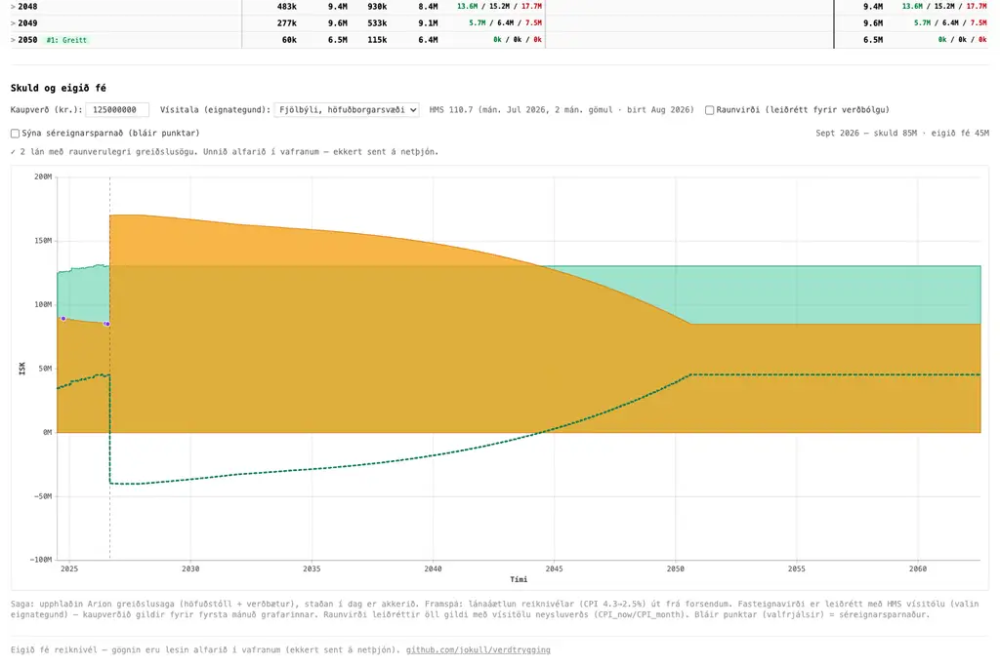

# Verðtrygging — eigið fé reiknivél

A client-side Vite + React SPA for tracking how your **equity** in an
index-linked (verðtryggt) mortgage develops over time. Extracted from the
`home` monorepo calculator and made standalone + anonymized.

**[Live at lanareiknivel.solberg.club](https://lanareiknivel.solberg.club)** · [GitHub](https://github.com/jokull/verdtrygging)



## Stack

- **Vite 7 + React 19 + TypeScript** (strict)
- **Tailwind CSS v4** (`@tailwindcss/vite`)
- **TanStack Charts** (`@tanstack/charts` + `@tanstack/react-charts`) for the
  debt/equity area chart
- **SheetJS (`xlsx`)** — parses the uploaded Arion "LoanPayments" export
  entirely in the browser
- **d3-scale** — time/linear scales for the chart

No backend, no server, no telemetry. The workbook never leaves the browser.

## How it works

1. **Loans are the source of truth.** Each loan is defined by its manual terms
   (current balance, APR, remaining months, method, extra payments) — the same
   fields the repayment schedule uses. Enter them in the loan card.
2. **Payment history is optional enrichment.** Each loan card can attach a real
   Arion "LoanPayments" `.xlsx` export. The upload hydrates the loan's
   `Lánsnúmer`, origination principal and start month (from the `Útgreiðsla`
   disbursement row) and stores the real monthly ledger. The manual balance
   stays the single anchor. Attach / detach per card.
3. **Chart = derived view.** For each loan: real past (if history attached,
   reconstructed backward from the balance — `balance_before = balance_after −
   indexation + principal`) + forward projection (from the loan's terms via the
   same engine the schedule table uses), joined at today. A loan shows a
   projection even with no history; history just makes the past real.
4. **Property is indexed by a real HMS series.** Pick a property type + region
   (fjölbýli / sérbýli × höfuðborgarsvæði / landsbyggð, or all-Iceland) from
   the dropdown; property is anchored so `kaupverð` is the value at the chart's
   first month and scales by the HMS index. A badge shows how fresh the data is
   ("HMS 110.7 (mán. Jul 2026, 2 mán. gömul · birt Aug 2026)"). Equity =
   property − total debt.
5. **`today` is the real current date** — the "today" marker, the chart's right
   edge, and the loan defaults (startMonth, base-rate years) all derive from
   `new Date()`, not a baked-in snapshot.

### HMS index data

The monthly series lives in `src/data/hms-data.json` (generated);
`src/data/hms.ts` is the logic wrapper (types, property-type options, per-month
interpolation). The data is captured from hms.is `kaupvisitala.csv` (columns
`VISITALA_FJOLBYLI_HOFUDBORGARSVAEDI`, `VISITALA_SERBYLI_*`, …). Seven series,
monthly 2020-01 → 2026-07, all published Aug 2026.

The CSV is served from a public OCI object-storage endpoint (not the bot-gated
hms.is page), so you can refresh the data in one command:

```sh
bun run refresh:hms
```

That fetches the live CSV and rewrites `src/data/hms-data.json`. hms.is itself
is behind a Vercel checkpoint — if the endpoint ever moves, open the page in a
real browser (agent-browser) and read the CSV from there.

### Data privacy

- No personal data is committed. The repo ships only anonymized default loans
  (68.25M / 9.4M) — "like my loan but not exactly like it."
- The chart has **no baked-in personal data**: debt comes from the uploaded
  workbook + user inputs; the only shipped data is public market data (HMS
  index) and public historical CPI.
- Historical CPI lives in `src/cpi.ts` (public Hagstofa data), used only for the
  optional "raunvirði" (real-terms) deflation toggle.

## Development

```sh
bun install
bun run dev       # http://localhost:5173
bun run build     # tsc -b && vite build → dist/
bun run preview   # serve the production build
```

## Deploy

Static SPA — `dist/` is a self-contained bundle. Deploy by copying the build
output to any static host:

```sh
bun run build
# copy dist/ to a static server / CDN / wrangler pages
```

The `home` deployment serves `calculator/dist` behind Caddy on the mac-mini
(`lanareiknivel.solberg.club`). This repo is standalone; point it at whatever
static host you like and serve `dist/` as the root.
